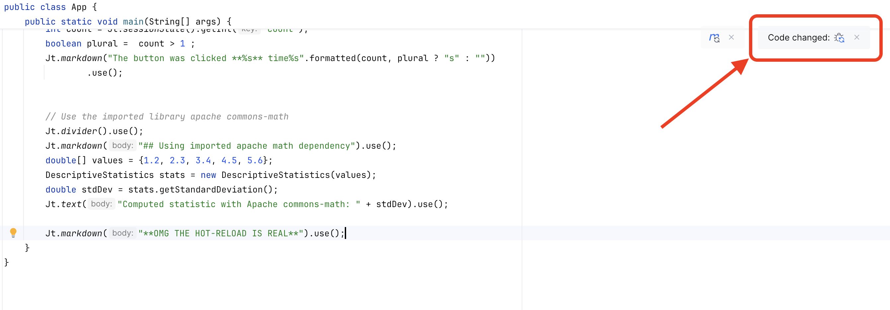

# javelit-example-embedded-maven
Example Javelit app that you can fork.
**Maven setup with embedded server.**


The key file to look at are [App.java](src/main/java/App.java), [Launcher.java](src/main/java/Launcher.java) and the [pom](pom.xml).  
More details about this example project are available in the [documentation](https://docs.javelit.io/get-started/installation/embedded-vanilla).

## Requirements

- `Java JDK >= 21`

## Installation

```bash
./mvnw clean install
```

## Run

```bash
./mvnw compile exec:java -Dexec.mainClass="Launcher"
```

The server will start on port 8080. Open your browser at [http://localhost:8080](http://localhost:8080).

## Development

## Development
IntelliJ HotReload works.
1. Launch [Launcher.java](src/main/java/Launcher.java) in `Debug` mode.
2. Go to the web app at [http://localhost:8080](http://localhost:8080)
2. Append the following to the [App.java](src/main/java/App.java) `main` method
   ```java
   Jt.markdown("**OMG THE HOT-RELOAD IS REAL**").use();
   ```
3. You should see a "Code Change" modal appear, click on it:
    
4. Refresh the web app at [http://localhost:8080](http://localhost:8080)
 
  
